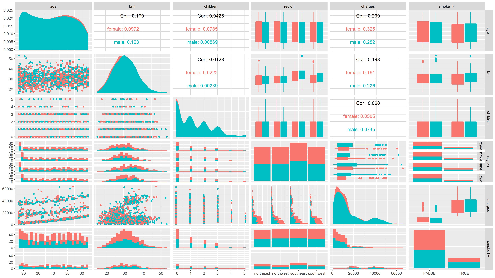

# Setup

```{r setup, include=FALSE}
knitr::opts_chunk$set(echo = TRUE)
```

```{r}
library(tidyverse)
library(GGally)
library(caret)
library(broom)
library(cluster)
library(glmnet)
```

# Read Data

```{r}
health0_raw <- read_csv("data/insurance.csv",
                        col_types = cols())
```


# Munge Data

```{r}
health1_newcols <- health0_raw %>%
    mutate(smokeTF = if_else(smoker == "yes", TRUE, FALSE))
```


# Explore Data

## Column Dimensions

```{r}
str(health1_newcols)
```

```{r}
summary(health1_newcols)
```

## Charts

```{r}
plot <- health0_raw %>%
    ggplot(aes(x = age, y = bmi, color = region)) +
    geom_point() +
    facet_grid(sex~smoker)

plot
```

### Pairs Plot

```{r}
health1_newcols %>%
    select_if(is.numeric) %>%
    plot()
```

```{r}

```

```{r}

```

```{r}

```


```{r pairs_plot, message = FALSE, warning=FALSE}
plot_cor <- health1_newcols %>%
    # select()
    GGally::ggpairs(columns = c(1, 3, 4, 6, 7, 8), aes(color = sex, fill = sex))

ggsave("pair_plot.png", plot = plot_cor, width = 16, height = 9)
```



# Modeling

## Regression

### Prep


```{r}
set.seed(23)
```

```{r}
trainIndex <- caret::createDataPartition(health1_newcols$charges,
                                         p = 0.8, list = FALSE)

health2_train <- health1_newcols[trainIndex, ]

health2_test <- health1_newcols[-trainIndex, ]
```

### Standard Linear Regression

```{r}
model_lm <- lm(formula = charges ~ age:age + bmi + bmi, data = health2_train)
model_lm2 <- lm(formula = charges ~ age:bmi, data = health2_train)
```

#### Outputs

```{r}
model_lm
model_lm2
```
```{r}
model_lm %>% glance()
model_lm_output <- model_lm %>% tidy()

summary(model_lm)
```

#### Measure Error

```{r}
p_lm <- predict(model_lm, health2_test)

error <- p_lm - health2_test$charges

RMSE <- sqrt(mean(error^2))

RMSE
```


### lm with caret


```{r}
model_lm2 <- train(charges ~ age + bmi + age:bmi,
                   data = health2_train,
                   method = "lm")
```


### lm with cv with caret
```{r}
f_train <- caret::trainControl(## 10-fold CV
                           method = "repeatedcv",
                           number = 10,
                           ## repeated ten times
                           repeats = 10)
```

```{r}
model_lm2 <- caret::train(charges ~ age + bmi + age:bmi,
                                trControl = f_train,
                                data = health2_train,
                                method = "lm")
```

### glm with cv with caret


```{r}
model_lm2 <- caret::train(charges ~ age + bmi + age:bmi,
                                trControl = f_train,
                                data = health2_train,
                                method = "glmnet"
                                # ,metric = "ROC"
                                )
```

## Clustering

### kmeans

```{r}

health3_numeric <- health2_train %>%
    select_if(is.numeric)

model_kmeans <- kmeans(health3_numeric, 4)

model_kmeans %>% broom::tidy()
model_kmeans %>% broom::glance()
```


```{r}
1:20 %>%
    map(~kmeans(health3_numeric, .)) %>%
    map_df(glance)
```


```{r}
health4_wCluster <- model_kmeans %>%
    broom::augment(health3_numeric)
```


### hierarchical clustering

## Classification

### decisions trees