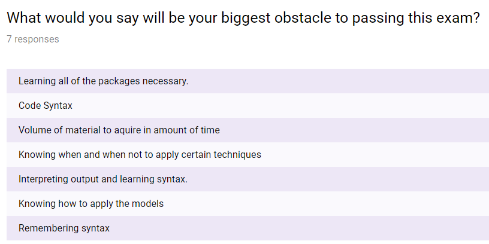

# Introduction

## Setup

```{r setup, include=FALSE}
knitr::opts_chunk$set(echo = FALSE)
```

```{r}
library(tidyverse)
```

## What does this code do? {.smaller}

The famous iris dataset
```{r}
iris <- iris %>%
    as_tibble()

iris %>%
    sample_n(3)
```


```{r, echo=TRUE, results='hide'}
iris2 <- iris %>%
    filter(Species == "setosa") %>%
    mutate(Petal.Area = Petal.Width * Petal.Length) %>%
    select(Species, Petal.Area) %>%
    arrange(Petal.Area)
iris2
```

## Answer

```{r, echo=TRUE}
iris2 <- iris %>%
    filter(Species == "setosa") %>%
    mutate(Petal.Area = Petal.Width * Petal.Length) %>%
    select(Species, Petal.Area) %>%
    arrange(Petal.Area)
iris2
```

## Quick Joke

What's pirate's favorite programming language?

## Agenda

1. Background on:
    1. Why we're here
    2. R, and the Tidyverse
    3. Data Science
2. Helpful Resources
3. Self-guided workshop

## Why are you here?

- Your career (i.e. the PA exam)
- Your curiousity?
- Future of Actuarial Science

## Exam PA - Predictive Analytics

- Required to be an actuary
- New exam representing the shift
- Newest and most different exam
- Prep class is more than $1000?

## Concerns over exam



## Why is he here?

**Motivation**

1. Learning R seriously leveled me up
2. I enjoy helping/teaching others.
3. That prep class is stupid expensive.
3. I get to take credit for anything you do in R in the future.

**My Background**

1. Started learning R 4 years ago
2. Failed a R coursera class 3 times before passing.
3. Taught high school math for 4 years.

## Today's Objectives

By the end of today's session, participants will be able to:

1. Comfortably start using R, RStudio, and the tidyverse.
2. Be able to explain the value of the above.
3. Know where to go to start learning
4. Have some hands-on experience using R and the tidyverse.


# The R universe

## R History

- S
    - 1976: invented by John Chambers (Bell Labs)
    - 1998: awarded ACM Computing Machinery award
- S-PLUS (commerical S)
    - 1988 Douglas Martin (UW Statistics)
    - most recently owned by TIBCO (on Westlake)
- R (a.k.a. base R)
    - 1995: initial version
    - created by Ross Ihaka & Robert Gentleman (University of Auckland) 
    - named after their first names and a play on "S"
- RStudio
    - 2011: JJ Allaire
    
## Why R 
- open-source
- large community
    - academics
    - over 10,000 packages on CRAN
- dataframe object
- "vectorized"
- built in libraries for:
    - stats,
    - graphics, and
    - linear algebra.

# Data Science

## Core Tenants Data Science

- Exploratory Data Analysis
- Reproducible Research
- Big Data
- Machine Learning

## Exploratory Data Analysis

- EDA vs. scientific method

## Reproducible Research
- reproducible, legible, shareable results
- has an explicit order (unlike crazy Excel files)
- Harvard Econ Austerity Paper
- rmarkdown (everything in one file)

## Big data (duh)

# The Tidyverse

## The R heir-apparent


## Benefits of the tidyverse

- R is nothing without the tidyverse
- emphasis on legibility (at a VERY small performance loss)
- very reproducible


## Today's Objectives

By the end of today's session, participants will be able to:

1. Comfortably start using R, RStudio, and the tidyverse.
2. Be able to explain the value of the above.
3. Know where to go to start learning
4. Have some hands-on experience using R and the tidyverse.